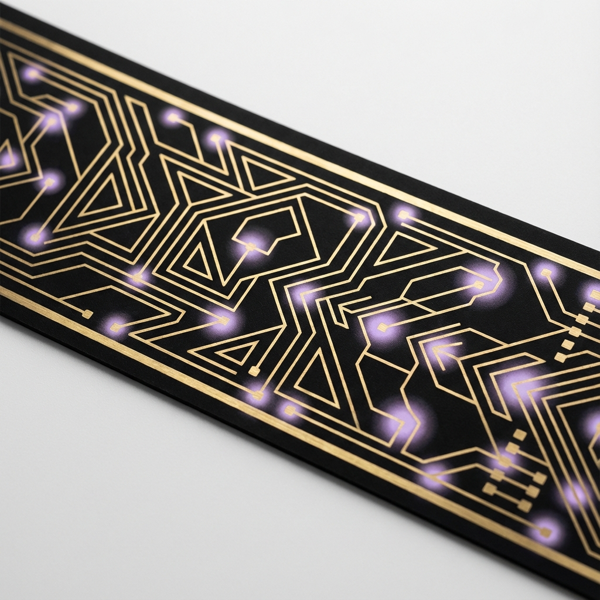
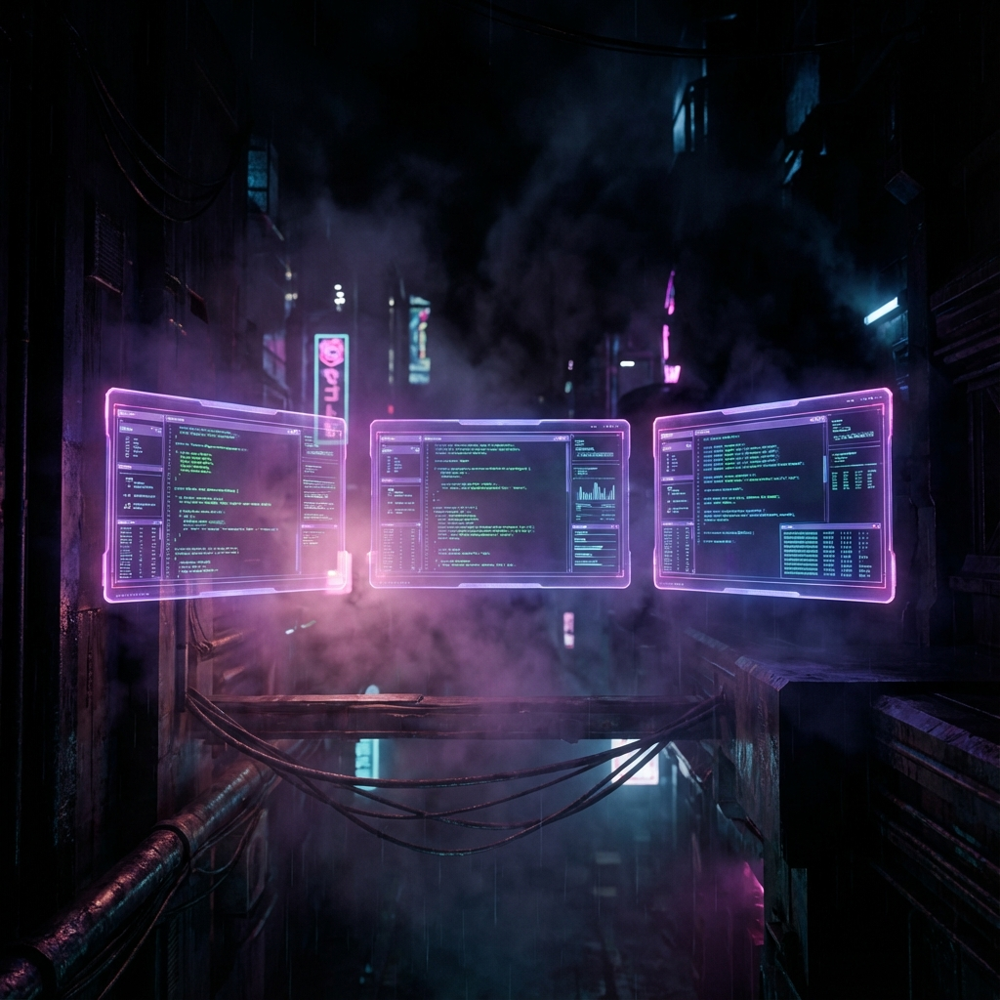

<!-- ═══════════════════════════════════════════════════════════════════════════
     ✦ PAVLE BRADIĆ — THE ORCHESTRATOR ✦
     ═══════════════════════════════════════════════════════════════════════════ -->

<!-- HEADER: Animated Gradient Wave -->


<div align="center">

  <!-- ═══════════════ VISUAL HERO SECTION ═══════════════ -->
  <table>
    <tr>
      <td align="center" width="150">
        
      </td>
      <td align="center">
        <h1>
          
        </h1>
        
      </td>
      <td align="center" width="150">
        
      </td>
    </tr>
  </table>

  <br/>

  <!-- Circuit Pattern Divider -->
  

  <br/><br/>

  <!-- ═══════════════ PUNCHY TAGLINE ═══════════════ -->
  <a href="https://github.com/zipajopa">
    
  </a>

  <br/><br/>

  <!-- ═══════════════ SOCIAL BADGES — Sleek Black ═══════════════ -->
  <p>
    <a href="mailto:boss@paja.pro">
      
    </a>
    <a href="https://github.com/zipajopa">
      
    </a>
    <a href="https://www.linkedin.com/in/bradic/">
      
    </a>
    <a href="https://x.com/zipajopa">
      
    </a>
    <a href="https://paja.pro">
      
    </a>
  </p>

  

</div>

<br/>

<!-- ═══════════════════════════════════════════════════════════════════════════
     VISUAL BREAK — Neon Terminals
     ═══════════════════════════════════════════════════════════════════════════ -->

<div align="center">
  
</div>

<br/>

<!-- ═══════════════════════════════════════════════════════════════════════════
     THE PITCH — Who Am I?
     ═══════════════════════════════════════════════════════════════════════════ -->

<div align="center">

```
┌─────────────────────────────────────────────────────────────────────────────┐
│                                                                             │
│   Senior AdOps Manager by day, AI Agent Architect by obsession.             │
│                                                                             │
│   I build autonomous LLM-powered systems that handle the boring stuff       │
│   so humans can focus on what actually matters. Belgrade → World.           │
│                                                                             │
│   Currently convincing my CEO that AI isn't taking our jobs—                │
│   it's just doing my laundry list of tasks automatically.                   │
│                                                                             │
└─────────────────────────────────────────────────────────────────────────────┘
```

</div>

<br/>

<!-- ═══════════════════════════════════════════════════════════════════════════
     THE ARSENAL — Tech Stack
     ═══════════════════════════════════════════════════════════════════════════ -->

<div align="center">
  <h2>
     
    The Arsenal
  </h2>
  
  
  
  <br/><br/>
  
  <table>
    <tr>
      <td align="center" width="33%">
        <br/>
        <h4>🧠 AI & Agents</h4>
        <code>pydantic-ai</code> · <code>LangGraph</code><br/>
        <code>MCP</code> · <code>OpenAI</code> · <code>Gemini</code>
      </td>
      <td align="center" width="33%">
        <h4>🔧 Backend</h4>
        <code>FastAPI</code> · <code>Convex</code><br/>
        <code>PostgreSQL</code> · <code>Redis</code>
      </td>
      <td align="center" width="33%">
        <h4>🎨 Frontend</h4>
        <code>Next.js 15</code> · <code>ShadCN</code><br/>
        <code>Tailwind</code> · <code>TypeScript</code>
      </td>
    </tr>
  </table>
</div>

<br/>

<!-- Circuit Pattern Divider -->
<div align="center">
  
</div>

<br/>

<!-- ═══════════════════════════════════════════════════════════════════════════
     CURRENT MISSION
     ═══════════════════════════════════════════════════════════════════════════ -->

<div align="center">
  <h2>🎯 Current Mission</h2>
  
  <table>
    <tr>
      <td>🤖</td>
      <td><strong>Autonomous Agent Constellation</strong> — Personal "Life OS" that manages tasks, emails, and workflows</td>
    </tr>
    <tr>
      <td>📊</td>
      <td><strong>Auto-AdOps Dashboard</strong> — Real-time monitoring with AI-powered anomaly detection</td>
    </tr>
    <tr>
      <td>🔗</td>
      <td><strong>MCP Ecosystem</strong> — Building modular AI tools that compose like LEGO</td>
    </tr>
    <tr>
      <td>💸</td>
      <td><strong>Free-Tier Exploiter</strong> — Because good architecture beats big budgets</td>
    </tr>
  </table>
</div>

<br/>

<!-- ═══════════════════════════════════════════════════════════════════════════
     CODE MATRIX VISUAL
     ═══════════════════════════════════════════════════════════════════════════ -->

<div align="center">
  
</div>

<br/>

<!-- ═══════════════════════════════════════════════════════════════════════════
     PROOF — GitHub Stats
     ═══════════════════════════════════════════════════════════════════════════ -->

<div align="center">
  <h2>📈 The Numbers</h2>
  
  <a href="https://github.com/zipajopa">
    
    
  </a>
  
  <br/><br/>
  
  <a href="https://github.com/zipajopa">
    
  </a>
</div>

<br/>

<!-- ═══════════════════════════════════════════════════════════════════════════
     TROPHIES
     ═══════════════════════════════════════════════════════════════════════════ -->

<div align="center">
  <h2>🏆 Achievements</h2>
  
</div>

<br/>

<!-- ═══════════════════════════════════════════════════════════════════════════
     THE SNAKE
     ═══════════════════════════════════════════════════════════════════════════ -->

<div align="center">
  <picture>
    <source media="(prefers-color-scheme: dark)" srcset="https://raw.githubusercontent.com/zipajopa/zipajopa/output/github-contribution-grid-snake-dark.svg" />
    <source media="(prefers-color-scheme: light)" srcset="https://raw.githubusercontent.com/zipajopa/zipajopa/output/github-contribution-grid-snake.svg" />
    
  </picture>
</div>

<br/>

<!-- ═══════════════════════════════════════════════════════════════════════════
     FOOTER
     ═══════════════════════════════════════════════════════════════════════════ -->

<div align="center">
  
  ---
  
  <sub>
    <em>"First, solve the problem. Then, write the code. Then, let AI rewrite it better."</em>
  </sub>
  
  <br/><br/>
  
  <a href="https://github.com/zipajopa">
    
  </a>
  
</div>


<!-- ═══════════════════════════════════════════════════════════════════════════
     Easter Egg: You found me! 🥚
     If you're reading this, you're either a recruiter who reads source code
     (respect) or another dev who appreciates good README aesthetics.
     Either way, let's connect: boss@paja.pro
     ═══════════════════════════════════════════════════════════════════════════ -->
